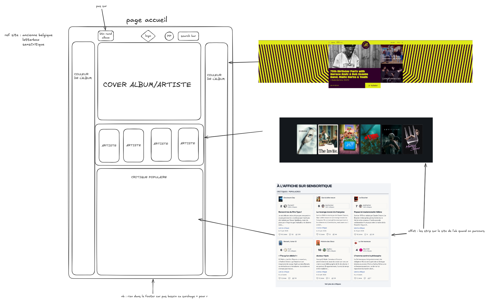
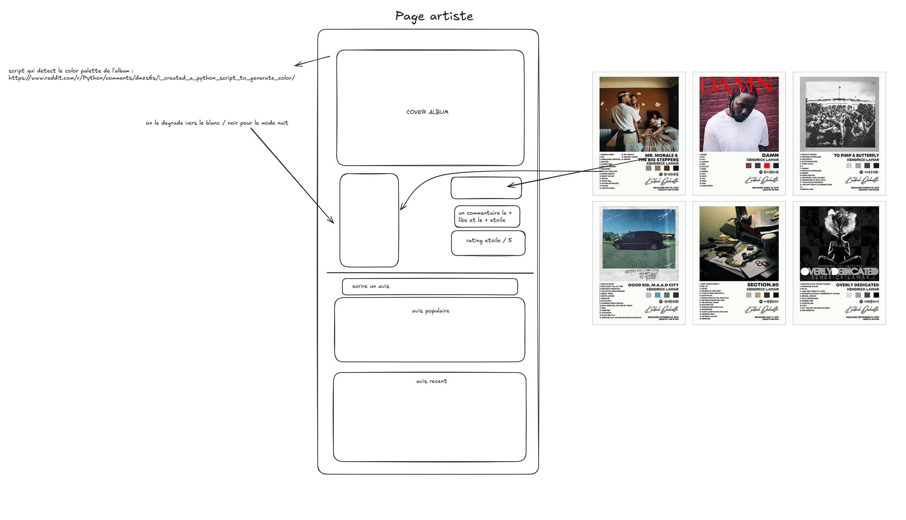

*This project has been created as part of the 42 curriculum by \<login1\>, \<login2\>, \<login3\>, \<login4\>, \<login5\>.*

# Saveboxd

> ⚠️ README squelette — à compléter au fil du projet (sections exigées par le
> sujet : Team Information, Project Management, Technical Stack, Database
> Schema, Features List, Modules, Individual Contributions, Resources + AI
> usage). Remplacer les `<loginX>` par les vrais logins. Doit être en anglais
> à la fin.

## Description

Saveboxd is a social platform for video games — think Letterboxd, but for
games. Users rate and review the games they played, build custom lists,
follow their friends' activity, chat, and get recommendations based on their
taste.

## Instructions

### Prerequisites

- Docker + Docker Compose
- A `.env` file (created automatically from `.env.example` on first run —
  fill in your secrets, it is gitignored)

### Run

```bash
make        # builds and starts everything (single command)
```

The app is served over HTTPS at **https://localhost:8443** (self-signed
certificate — accept the browser warning). API healthcheck:
`https://localhost:8443/api/health`.

Other targets: `make logs`, `make down`, `make clean` (wipes the DB), `make re`.

## Technical Stack

- **Frontend**: React 19 + TypeScript + Vite + Tailwind CSS
- **Backend**: NestJS + Prisma (ORM)
- **Database**: PostgreSQL
- **Proxy**: nginx (TLS termination, HTTPS only)
- **Game data**: IGDB API

## Design mockups

Early mockups (Excalidraw sources in [docs/mockups/](docs/mockups/), open them
on [excalidraw.com](https://excalidraw.com)):

| Front page | Game page | Artist/Studio page | UI review |
|---|---|---|---|
|  |  |  |  |

## Resources

- [ft_transcendence subject (v21.1)](https://cdn.intra.42.fr)
- [NestJS documentation](https://docs.nestjs.com)
- [Prisma documentation](https://www.prisma.io/docs)
- [React documentation](https://react.dev)
- [Tailwind CSS documentation](https://tailwindcss.com/docs)
- [IGDB API documentation](https://api-docs.igdb.com)

### AI usage

*To be documented: which tasks and which parts of the project used AI
assistance (required by the subject).*
