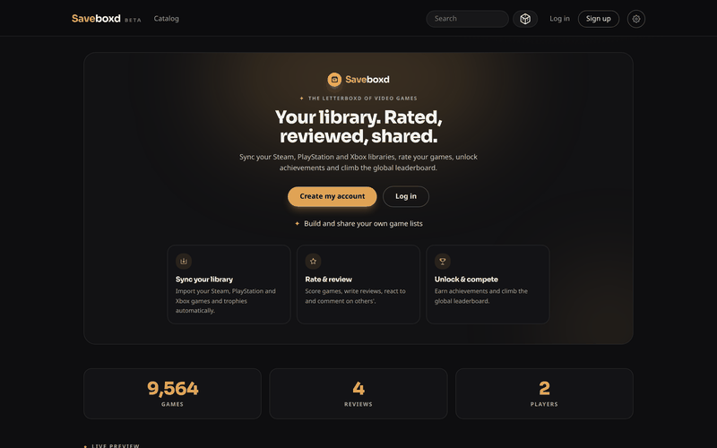
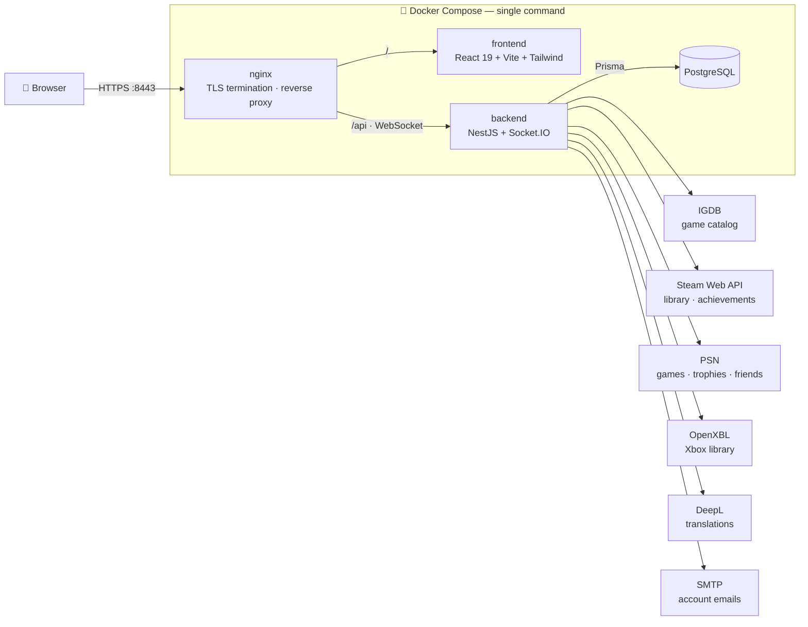
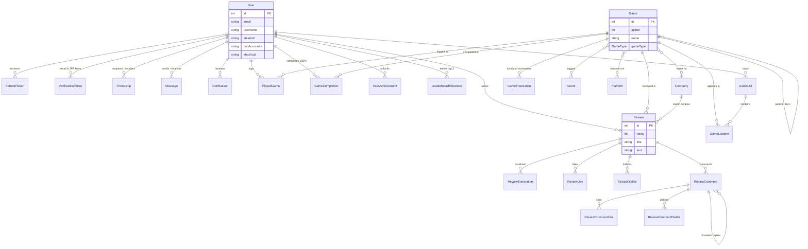

# Saveboxd &nbsp;🎮

[](https://www.typescriptlang.org/)
[](https://react.dev)
[](https://nestjs.com)
[](https://www.postgresql.org/)
[](https://www.prisma.io)
[](https://socket.io)
[](https://tailwindcss.com)
[](https://www.docker.com/)
[](#license)

## Introduction

**Saveboxd** is **the Letterboxd of video games** — a social platform to track, rate,
review and discover games, and to follow what your friends are playing.

It is the **final project of the 42 Common Core** (*ft_transcendence*), built as a
team of 4 over several weeks: a full real-world web application with its own
frontend, backend, database, real-time layer and external integrations.

> 🕹️ The killer feature: link your **Steam / PlayStation / Xbox** account and your
> real library and trophies are imported automatically, matched against a
> catalog of **9,500+ games** sourced from IGDB.

<p align="center">
  
</p>

---

## Features

### 🗃️ Game Catalog
- **9,500+ games** imported from the **IGDB API** (covers, genres, platforms, studios)
- Advanced search: text, genre, platform, studio — with sorting and pagination
- Live search with **on-the-fly IGDB import** when a game isn't in the catalog yet
- DLC/expansion handling (grouped under their parent game) and per-studio pages
- Bayesian rating blending user scores with IGDB & Steam review data

### ⭐ Ratings & Reviews
- Rate games **0–10**, write reviews, like/dislike — **studios can be reviewed too**
- **Threaded comments** (Reddit-style) with live updates and inline editing
- Real-time review feed on each game page via WebSockets
- Rating-distribution histogram on every game, reviews **auto-translated** to your language

### 📚 Game Lists
- Create custom lists (public or private), share them with friends
- **Drag & drop** reordering, compact/regular display styles with covers
- Add-to-list menu directly from any game page

### 👥 Social
- Friends system with **online presence** and smart friend suggestions
  (your Steam/PSN friends already on Saveboxd, fellow 42 students…)
- Real-time **direct chat** (Socket.IO) — share games, reviews and profiles straight into a conversation
- **Public profiles**: stats, favorites, reviews, lists and achievements tabs
- Activity **feed** of what your friends play, review and achieve, with filter tabs
- Full **notification** system with per-type preferences

### 🔄 Library & Trophy Sync
- Link **Steam** (OpenID), **PlayStation** (PSN Online ID) and **Xbox** accounts
- Imports your owned/played games **and achievements/trophies**
- ETL pipeline: fetch → normalize → match to catalog → cache & resync

### 🏆 Gamification
- Home-made **achievement system** (8 families, multiple tiers)
- **Rank badges** on profiles for top-3 leaderboard players
- Global & friends **leaderboards**: completions, games played, reviews
- Profile **activity calendar** (GitHub-style yearly heatmap)

### 🤖 Recommendations
- Personalized picks from your taste profile (genres, studios, ratings, plays)
- Every recommendation comes with an **explained reason** — *"because you liked X"*
- Already-completed games are filtered out

### 🌍 Internationalization
- **13 languages**, full UI translation with a language switcher
- Game summaries translated **on the fly** via DeepL

### 🔐 Accounts & Security
- Email/password auth with **Argon2** hashing and email verification
- **OAuth 2.0** login via Google & Discord
- **TOTP 2FA** (authenticator app + QR enrollment)
- JWT sessions (access + refresh) in httpOnly cookies, rate limiting, Helmet
- **GDPR**: self-service data export (JSON) and account deletion with email confirmation

### ✨ Polish
- Onboarding wizard + interactive **guided tour** of the interface
- Custom design system (Tailwind) with **day/night theme**, fully responsive
- Accessibility: WCAG touches, keyboard focus rings, screen-reader labels
- Avatar upload (images & **GIFs**) with sensible defaults
- Loading skeletons, polished empty states, code-split bundle for fast loads

---

## Usage

### 1. Prerequisites

- **Docker** + **Docker Compose**
- A `.env` file — copy the template and fill in the secrets:

```bash
cp .env.example .env
# DB password, JWT secret, SMTP, IGDB / OAuth / Steam / PSN keys…
```

> External integrations (library sync, translation) only work with their API
> keys — the core app runs fine without them.

### 2. Run (single command)

```bash
make
```

The app is served over **HTTPS** at **https://localhost:8443**
(self-signed certificate — accept the browser warning).

> The catalog boots instantly with **1,000 games** from a committed fixture
> (works offline). Run `make catalog-import` once to load the **full 9,500+
> game catalog** — no API keys needed.

### 3. Useful targets

```bash
make logs     # follow container logs
make seed     # populate the catalog with demo data
make re       # full rebuild
make clean    # stop everything and wipe the database
```

---

## Architecture



### Database schema

PostgreSQL, managed with Prisma ([`schema.prisma`](backend/prisma/schema.prisma)
is the single source of truth):



<sub>Enums: `AuthProvider` · `FriendshipStatus` · `VerificationTokenType` ·
`PlayStatus` · `NotificationType` · `GameType` · `MessageType`</sub>

---

## Tech Stack

| Layer | Technology |
|---|---|
| Frontend | **React 19** + TypeScript + Vite + Tailwind CSS |
| Backend | **NestJS** (Node + TypeScript) |
| Database | **PostgreSQL** + **Prisma** ORM |
| Real-time | **Socket.IO** (presence, chat, feed, notifications) |
| Auth | JWT + Passport (Google/Discord OAuth) + Argon2 + otplib (2FA) |
| Reverse proxy | **nginx** (TLS termination, HTTPS only) |
| External APIs | IGDB · Steam Web API · psn-api · DeepL |
| Deployment | **Docker Compose** — one command |

---

## 42 Modules

The subject requires **14 points** (Major = 2 pts, Minor = 1 pt). We validated
**19 points**:

| Module | Type | Pts |
|---|---|---|
| Frontend + backend frameworks (React + NestJS) | Major | 2 |
| Real-time features — WebSockets | Major | 2 |
| User interaction (chat + profiles + friends) | Major | 2 |
| Standard user management | Major | 2 |
| AI recommendation system | Major | 2 |
| Multi-platform library & trophy sync *(custom module)* | Major | 2 |
| ORM (Prisma) | Minor | 1 |
| Multiple languages (13) | Minor | 1 |
| OAuth 2.0 (Google & Discord) | Minor | 1 |
| Two-Factor Authentication (TOTP) | Minor | 1 |
| Notification system | Minor | 1 |
| Gamification (achievements + badges + leaderboards) | Minor | 1 |
| GDPR compliance (data export, account deletion) | Minor | 1 |

---

## Team Members

### [**@Zaiicko**](https://github.com/Zaiicko)
- **Project foundation** — Docker Compose (nginx HTTPS, PostgreSQL, NestJS, React), Prisma schema, 42-style Makefile
- **Game catalog** — IGDB sync & seed (9,500+ games), live search with on-the-fly IGDB import, filters & sorting (bayesian score blending user + IGDB + Steam ratings), DLC/expansion system, studio pages, catalog export/import tooling for the team
- **Platform integrations** — Steam (OpenID login/lin📄 Full module details, database schema and individual contributions: docs/README_evaluation.mdking, library, achievements, review-score sync), PlayStation (PSN ID linking, games + trophies + friends via psn-api), Xbox (OpenXBL linking + library + gamerscore), unified "My libraries" page, hourly background re-sync cron, real 100% completion detection & dates
- **Reviews & lists (frontend)** — threaded comments UI with live reactions, inline review/comment editing, paginated & sortable reviews with deep links, rating-distribution histogram, auto-mark-played on review, custom game lists (public/private, add-to-list menu)
- **Social layer** — real-time chat with floating widget and game/review/profile shares, activity feed (typed timeline, filter tabs, live updates), notification bell + per-type preferences, combined friend suggestions (Steam / 42 / PSN), public profile pages
- **Gamification** — native achievements engine (13 families, bronze→diamond tiers, event-driven detection), leaderboards (podium, friends/global, monthly/all-time), top-3 rank badges & milestone feed events
- **Recommendations** — evolved the engine into a taste profile blending reviews & played games (rating/recency/diversity weighted), explained reason on every pick, completed games filtered out
- **UX & design** — full redesign of every page (home, catalog, game, profile, settings, friends, feed, leaderboard, auth) on a custom dark design system, onboarding wizard + guided tour, responsive nav, loading skeletons & empty states
- **i18n & perf** — i18n coverage of every feature in 13 languages, frontend code-splitting (~443 → ~126 KB gzip initial bundle)
- **Testing** — full testing of the entire app

### [**@FtAlama**](https://github.com/FtAlama)
- **Reviews system (backend)** — review model & API, threaded Reddit-style comments, real-time Socket.IO gateway, net-score sorting, review auto-translation, studio (company) reviews
- **Lists & profile** — game lists polish (drag & drop, compact/regular styles, covers, limits), profile completion calendar improvements (finished/playing games, multi-year, 4K fixes), GIF profile avatars
- **Frontend** — early UI mockups & front page concept, day/night theme, favicon, accessibility (WCAG), page-state caching on back-navigation, cross-browser fixes (Chrome/Firefox), UX/bug-fix polish
- **Backend & tooling** — persistent notifications, users module groundwork, seed fixes, public-view privacy hardening, ESLint setup
- **Testing** — full testing of the entire app

### [**@SoLeQz**](https://github.com/SoLeQz)
- **Authentication** — signup/login with JWT cookies, avatar upload, account deletion, friends & presence backend, 42 badge & first friend suggestions
- **Account security** — TOTP 2FA, email verification, password reset, brute-force protection, mailer hardening
- **OAuth & i18n** — Google & Discord OAuth, i18n foundation (13 languages), DeepL translation pipeline with per-language caching
- **Recommendations** — first version of the personalized home recommendations
- **Content** — Privacy Policy & Terms of Service in all 13 languages

---

## Resources

- [NestJS](https://docs.nestjs.com) · [Prisma](https://www.prisma.io/docs) · [React](https://react.dev) · [Socket.IO](https://socket.io/docs/v4/)
- [IGDB API](https://api-docs.igdb.com) · [Steam Web API](https://steamcommunity.com/dev) · [psn-api](https://psn-api.achievements.app) · [DeepL API](https://developers.deepl.com)

**AI usage** — an LLM coding assistant was used as a productivity tool
(scaffolding features, i18n translations, debugging, UI polish), always
reviewed, tested and adapted by the team. No feature was submitted that its
author could not explain and defend.

---

## License

This project is **not open source** — Copyright © 2026
[@Zaiicko](https://github.com/Zaiicko), [@FtAlama](https://github.com/FtAlama),
[@SoLeQz](https://github.com/SoLeQz). **All rights reserved.**

The code is published for consultation, evaluation and portfolio purposes
only. No permission is granted to use, copy, modify or redistribute it, in
whole or in part, without the authors' written consent. Submitting this code
as your own in any academic context (including the 42 curriculum) constitutes
plagiarism.

---

## Screenshots


